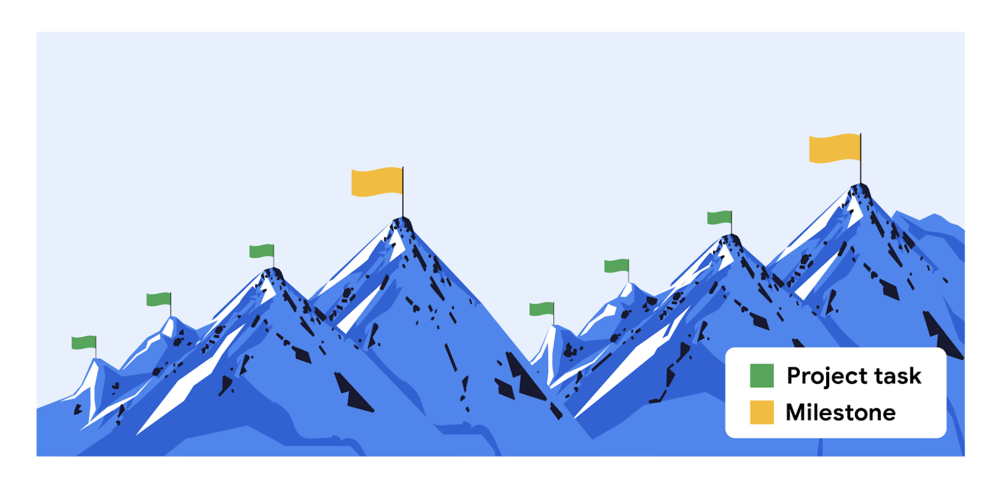
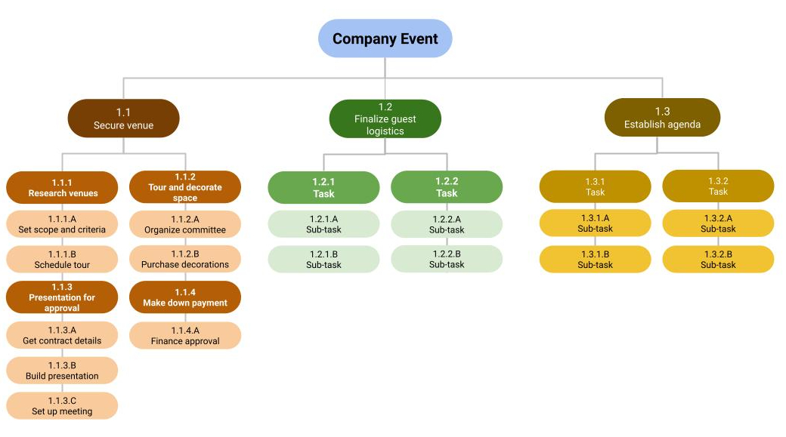

# Beginning the Planning Phase

## Leading a successful kick-off meeting
A kick-off meeting is the first meeting among the project team, stakeholders, and the project sponsor at the start of a new project or new project phase. The purpose of a kick-off meeting is to ground everyone in a shared vision, ensure they understand the project’s goals and scope, and make sure that they are all on the same page about their roles and responsibilities on the project. The kick-off meeting is critical to a project’s overall success. It gets the team together to align on goals and visions for the project and sets the project up for success.

## Kick-off meeting best practices
- **Set the right time**. Choose a meeting time that works for everyone. Be mindful of time zone differences. 
- **Set the right length**. Choose an appropriate meeting length—no more than one hour. You don’t want to waste people’s time, but you also don’t want to run out of time. Kick-off meetings work best when you first share key information and then spend any additional time on questions and team building.
- **Invite the right people**. Be strategic about including the appropriate people. The goal is to invite attendees who play a role in the development and execution of the project, such as all team members, stakeholders, and the project sponsor. You don’t want to leave anyone out, but you also don’t want to invite people who shouldn’t be there.
- **Designate a notetaker**. The discussion that takes place during the meeting is important. It is critical that you document any feedback, changes, or questions asked by attendees. If you are leading the meeting, designate someone else to take notes before the meeting starts. You can also use tools like Chorus Notetaker, Google Keep, Google Docs, or Microsoft OneNote.  
- **Set the agenda**. To recap what we discussed in the video, a kick-off meeting agenda should generally include: introductions, the project background and purpose, project goals and scope, roles and responsibilities, the collaboration process and project tools, what comes next (expectations and action items), and time for questions and discussion.
- **Share the agenda**. Prior to the meeting, share the agenda with attendees via email and identify speakers for each topic. By sending the agenda in advance, everyone will have an idea of what to expect, time to prepare for anything they may need to present or discuss, and time to generate questions or ideas.
- **Stick to the agenda**. During meetings, discussions can sometimes go off topic or take longer than expected. As a project manager, it is your job to keep the meeting on track by redirecting discussions to the items on the agenda. 
- **Follow up after the meeting**. After the meeting, make sure to send out a meeting summary featuring the meeting notes and any action items. 

## Setting milestones: Best practices
Let’s revisit the definitions of tasks and milestones. 
- A **project task** is an activity that needs to be accomplished within a set period of time and is assigned to one or more individuals for completion. The work of a project is broken down into many different project tasks. 
- A **project milestone** is an important point within the project schedule that usually signifies the completion of a major deliverable. Milestones are significant checkpoints in your project, and keeping track of them helps ensure that your project is on schedule to meet its goals.

### Set tasks to identify milestones
Setting tasks can help you clearly define milestones. You can do this in two ways:
- **Top-down scheduling**: In this approach, the project manager lays out the higher-level milestones, then works to break down the effort into project tasks. The project manager works with their team to ensure that all tasks are captured.
- **Bottom-up scheduling**: In this approach, the project manager looks at all of the individual tasks that need to be completed and then rolls those tasks into manageable chunks that lead to a milestone. 

Most projects have many tasks that lead to milestones. For instance, if your milestone is to receive approval on the first draft of an article that you are writing, you might complete tasks such as “develop outline,” “write first draft,” and “send to the editor.” Then, you may have another set of tasks to achieve before reaching the milestone of revising the article. Milestones serve as check-in points along your project to make sure that you are headed in the right direction toward the end goal. Milestones also make projects more manageable.

### Integrate milestones into your project schedule
There is not a consistent number of milestones in every project. Some projects will have a few milestones, while others may have dozens. Rather than aiming to hit a certain number of milestones, try to set milestones for the most important events in your project. Review your project schedule and identify important moments or checkpoints. In other words, pinpoint where in your project you will achieve major goals and make those points your milestones. 

### Milestone-setting pitfalls
Here are some things to avoid when setting milestones: 
- **Don’t set too many milestones**. When there are too many milestones, their importance is downplayed. And, if milestones are too small or too specific, you may end up with too many, making the project look much bigger than it really is to your team and stakeholders.  
- **Don’t mistake tasks for milestones**. Remember that milestones should represent moments in time, and in order to map out how you will get to those moments, you need to assign smaller tasks to each milestone.
- **Don’t list your milestones and tasks separately**. Make sure that tasks and milestones can be visualized together in one place, such as a project plan. This will help ensure that you are hitting your deadlines and milestones. 

### Key takeaways
Your approach to setting milestones may differ from project to project, but most projects will have at least one milestone and several smaller tasks associated with each milestone. Setting clearly-defined, distinct tasks, and milestones, integrating them into your project schedule, and using a tool that visualizes them together will help organize your project and drive it forward. 

## Breaking down the work breakdown structure
A WBS is a deliverable-oriented breakdown of a project into smaller components. It’s a tool that sorts the milestones and tasks of a project into a hierarchy, in the order they need to be completed. A thorough WBS gives you a visual representation of a project and the tasks required to deliver each milestone. It makes it easier to understand all of the essential project tasks, such as estimating costs, developing a schedule, assigning roles and responsibilities, and tracking progress. Think of each piece of information as part of the overall project puzzle—you can’t successfully navigate through the tasks without understanding how they all fit together. For instance, many smaller tasks may ladder up to a larger task or milestone.

### Steps to build a WBS
As a reminder, here are three main steps to follow when creating a WBS: 
- **Start with the high-level, overarching project picture. Brainstorm with your team to list the major deliverables and milestones**. Example: Imagine you are planning a company event. Your major milestones might include categories like “secure venue,”  “finalize guest logistics,” and “establish agenda.”
- **Identify the tasks that need to be performed in order to meet those milestones**. Example: You could break a milestone like “secure venue” down into tasks like “research venues,” “tour and decorate space,” “make down payment,” and so on. 
- **Examine those tasks and break them down further into sub-tasks**. Example: You could break down a task like “tour and decorate space” further into sub-tasks like “organize decorating committee,” “purchase decorations,” “assign decorating responsibilities,” and so on