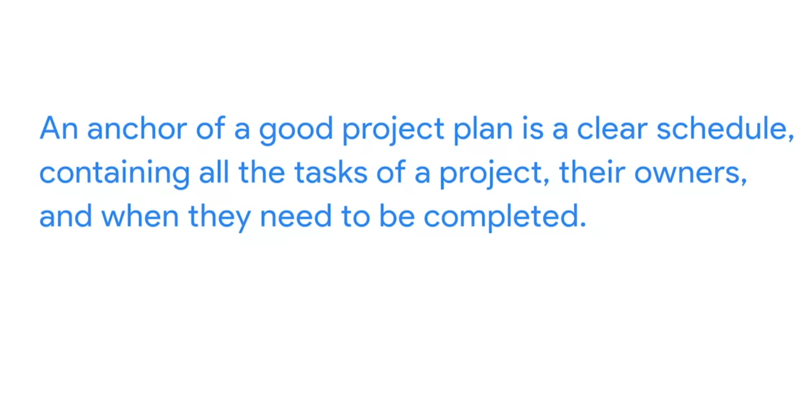
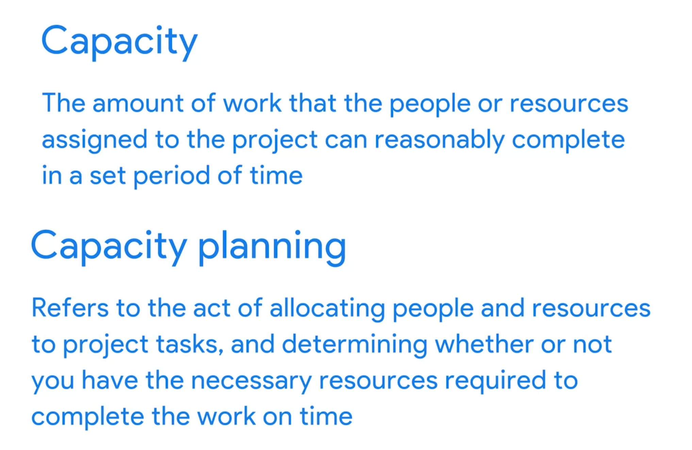
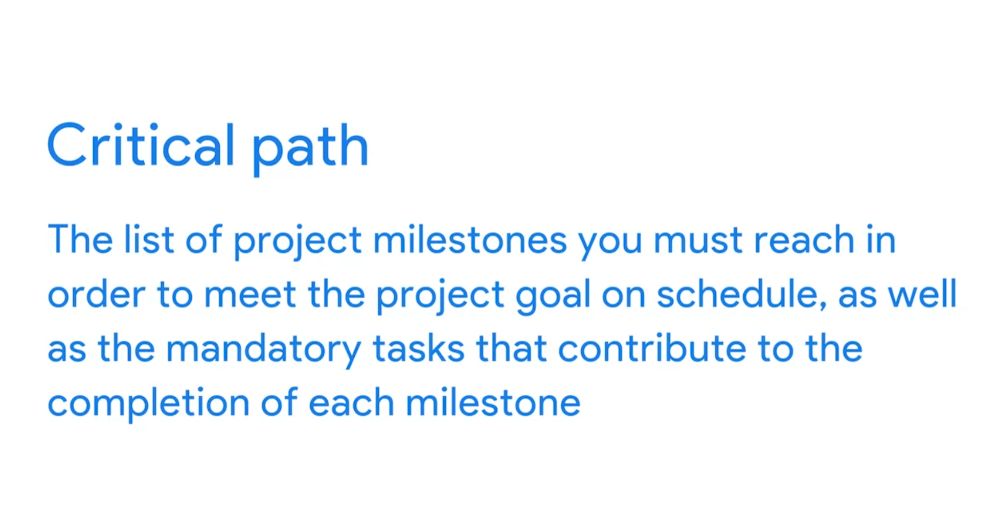
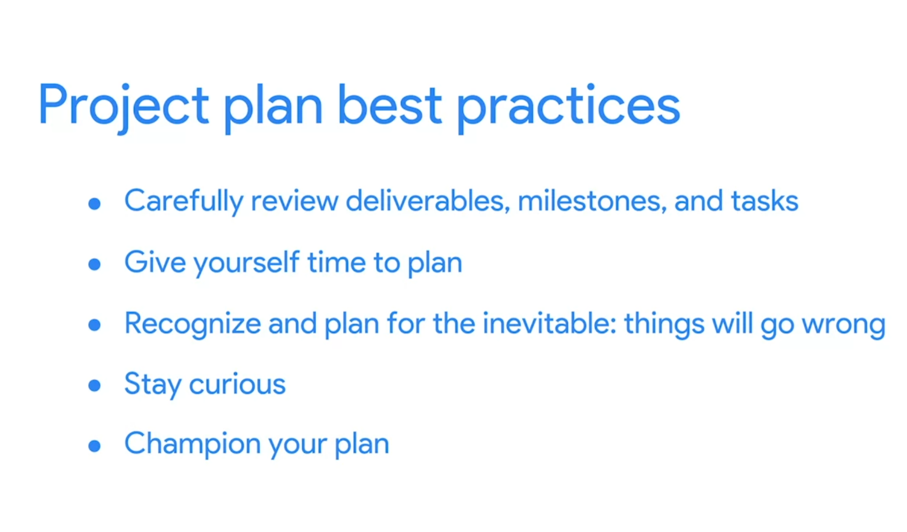

# Building a project plan

## Putting together the pieces of a project plan
Every project plan is a living artifact that serves as your team’s roadmap throughout the project. Some common elements of project plans are tasks, milestones, people, documentation, and time. Let’s look at how these elements intersect with other important components to create a comprehensive plan for your project. 

### How project plan components are connected
At the center of the project plan is the project schedule, which helps you estimate the amount of time it will take to complete the project and provides the team with a way to track the project’s progress against your goals. In addition to the schedule, you should also include the following components in your project plan: 
- Scope and goals
- Work Breakdown Structure (WBS)
- Budget 
- Management plans

### Project scope and goals
Both the project scope and goals will be captured initially in your project charter, the document that clearly defines the key details of your project. You can link your project charter in your project plan. Having details about the project’s scope and goals easily accessible can help remind your team of the objectives they are trying to accomplish and if anything is asked of them that goes beyond what was initially agreed upon in order to achieve those objectives. 

### Work Breakdown Structure (WBS)
As a reminder, a Work Breakdown Structure is a tool that sorts the milestones and tasks of a project in a hierarchy, in the order they need to be completed.  The WBS is key to your project plan since it breaks the work down into more manageable pieces. In your project plan, the tasks should be visible in one place with clear descriptions, owners, and due dates. This will allow you and your team to understand who is responsible for which tasks and when each task is supposed to be completed. Your project plan should also contain detailed milestones and statuses related to these tasks, which will help you and your team members visualize project progress. 

In addition to the WBS, further documentation—such as a RACI chart—will help define roles and responsibilities and would be useful to add to your project plan. Keeping this documentation stored or linked in one place is a best practice for transparency and effective communication.

### Budget
Throughout the life cycle of your project, the budget will need to be managed and monitored. The project budget is often linked to the project plan because it is heavily dependent on key elements of the project. Linking these components allows for smoother management and visibility. 

Depending on the size of your project and your organization, you may not be the primary person responsible for managing the project budget. For instance, if your project is at a large organization and the funds are managed by another department, you may not have as much autonomy or insight into all of the budget elements. As a result, you may not be able to monitor the budget closely. If someone in another department is managing the budget, make sure to have regular check-ins with them to ensure that you are aware of how you are tracking.

### Management plans
Management plans—such as the change management plan, risk management plan, and communication plan—are all integral to keeping a project organized and on track and should be linked in your project plan. These plans will be discussed in detail in the coming lessons of this course. 

### Key takeaway
Project scope and goals, the Work Breakdown Structure (WBS), the budget, and management plans are all important components of your project plan. They help define how basic project plan elements—including tasks, milestones, people, documentation, and time—will be structured and utilized in your project. However, no two project plans will be the same. At Google, we work with a variety of different tools and templates to create and manage project plans. It is important to know your end goals and what is essential to you and your team in order to pull the relevant pieces of the project together. 

## Overcoming the planning fallacy
It is human nature to underestimate the amount of time and effort it takes to complete a task—from anything as simple as walking the dog to something as complex as completing a project. People generally want to remain hopeful about a positive outcome, and this is a great quality to have as a person. But as a project manager, this kind of optimism can also be a deficiency, especially during the planning phase of a project. Being on the lookout for “what-ifs” is a key project management skill. Considering situations that could affect whether or not the project is completed on time can help you overcome the planning fallacy. Also, you will always have a project team in your corner, so make sure you use them as resources to help uncover possible risks. Remember to be “optimistically realistic” and push for the best outcome while still planning for the proper time to accomplish each task.

## Creating a project plan: Tools and templates
**Project plans** are critical because they are used to capture the scope and time it takes to complete a project. The project plan is essentially the project’s blueprint—it lays out all of the activities and milestones that your team needs to achieve in order to successfully complete the project. Project plans come in various shapes, sizes, and forms. Depending on the project you are managing, the template you use may vary, and some companies even have standard templates they require their project managers to use. As a general rule, it is best to use a spreadsheet for a simple project and project management software for a more complex project. Regardless of what tool you use, be sure to include this key information: 

- **Task ID numbers or task names**: You might end up with dozens, hundreds, or even thousands of tasks in a project. Assigning a task ID or name makes it easy to find and reference a task when communicating with team members and stakeholders. 
- **Task durations**: A task duration is the amount of time you estimate that task should take. Adding task durations to your project plan helps you organize and prioritize the tasks in the project to help ensure you hit your goal on time. 
- **Start and finish dates**: Including start and finish dates for each task helps you track whether you are progressing on time or not. 
- **Who is responsible for what**: Including each team member’s role and responsibilities helps promote clarity and efficiency. As a best practice, assign an owner to each task, as well.

