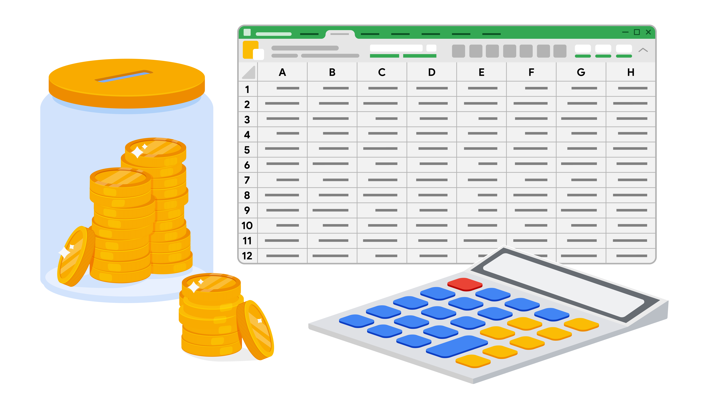
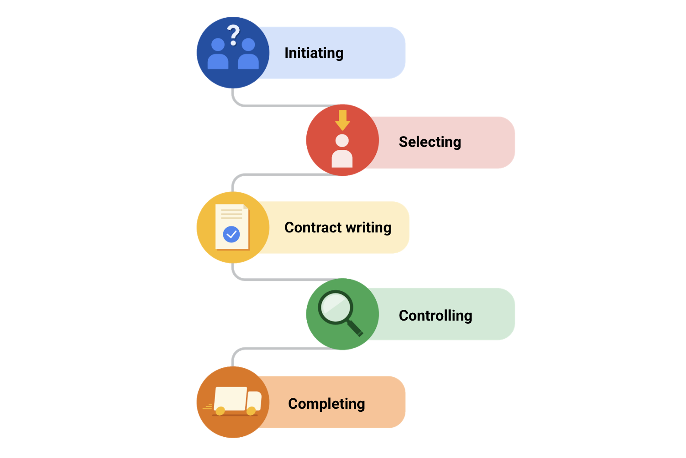

# Managing budgeting and procurement

## Project budgeting 101
A project budget is the estimated monetary resources needed to achieve a project's goals and objectives. Budgets are typically created in the initiation and planning phases of your project. As with any other project management document, you need to continue to review and control the budget throughout the life cycle of your project. Your budget is more than just how much it will cost to complete the project—it is a helpful tool to reference when communicating with stakeholders and can double as a tracker for your project’s progress. Budgets also help control your costs and act as the baseline for the financial portion of the project. 

## Project budgeting best practices
Here are a few tips to consider when creating your project budget:
- **Reference historical data**: Your project may be similar to a previous project your organization has worked on. It is important to review how that project’s budget was handled, find out what went well, and learn from any previous mistakes.
- **Utilize your team, mentors, or manager**: Get into the habit of asking for your team to double check your work to give you additional sets of eyes on your documents.
- **Time-phase your budget**: Time-phased budgeting allows you to allocate costs for project tasks over the projected timeline in which those expenses are planned to take place. By looking at your tasks against a timeline, you can track and compare planned versus actual costs over time and manage changes to your budget as necessary.
- **Check, check, and double check**: Make sure that your budget is accurate and error-free. Your budget will likely require approval from another department, such as finance or senior management, so do your best to ensure that it is as straightforward to understand as possible and that all of your calculations are correct.

### Develop a baseline budget
A baseline budget is an estimate of project costs that you start with at the beginning of your project. Once you have created a budget for your project and gotten it approved, you should publish this baseline and use it to compare against actual performance progress. This will give you insight into how your project budget is doing and allow you to make informed adjustments. It is important to continually monitor your project budget and make changes if necessary. Be aware that budget updates can require the same approvals as your initial budget. Also, you should “re-baseline” your budget if you make significant changes. Re-baselining refers to when you update or modify a project's baseline as a result of any approved change to the schedule, cost, or deliverable content. For example, if you have a significant change in your project scope, your budget will likely be impacted. In this instance, you would need to re-baseline in order to adhere to a realistic budget.

### Perform a reserve analysis
A reserve analysis will help you account for any buffer funds you may need. First, review all potential risks to your project and determine if you need to add buffer funds, also referred to as a contingency budget. These funds are necessary because new costs that you did not expect are likely to happen throughout the project. You may also want to account for cost of quality in your overall project budget. The cost of quality refers to all of the costs that are incurred to deliver a quality product or service, which can extend beyond material resources. This includes addressing issues with products, processes, or tasks, along with internal and external failure costs. One example would be having to redesign a product or service due to defects. A defect could mean refunds to customers, time and money required to create a new product or service, and multiple other potential costs affecting the client.

### Key takeaways
Budgeting in the project management world is a complex process involving many different parties and documentation, but following the best practices described in this reading can help break it down. Remember to use historical data and time-phasing, and reach out to your team for support. Make sure you are capturing all of the components of your budget, including direct and indirect costs. Finally, be sure to baseline your budget so you know where your money is being used and when. These tips can help set you up for budget management success.

## Overcoming budgeting challenges
Effective budgeting can set you up for success as a project manager. Here are some of the most common budgeting challenges you may encounter as a project manager and how to manage them.

### Challenge 1: Budget pre-allocation
You may encounter situations where your budget is already set before you even start the project. This is known as budget pre-allocation. Some organizations follow strict budgeting cycles, which can lead to cost estimations taking place before the scope of the project is completely defined. If you are given a pre-allocated budget, it is important to work with your customer to set expectations on scope and deliverables within the allocated budget. To deliver a great product within your allocated budget will require detailed planning.

A pre-allocated budget should also be routinely monitored to ensure the amounts you have budgeted are sufficient to meet your costs. Be sure to carefully track all expenses in your budget. Regularly match these expenses against your pre-allocated budget to ensure you have sufficient funds for the remainder of your project. Part of that planning includes making sure that you are tracking fixed and time- and materials-based expenses. Fixed contracts are usually paid for when certain milestones are reached. Time and materials contracts are usually paid for monthly, based on the hours worked and other fees associated with the work, such as travel and meal expenses. 

### Challenge 2: Inaccurately calculating TCO
Another budgeting pitfall you should try to avoid is underestimating the total cost of ownership (TCO) for project resources. TCO takes into account multiple elements that contribute to the cost of an item. It factors in the expenses associated with a product or service over its lifetime, rather than just upfront costs. 

Let’s relate TCO to something more common, like owning a vehicle. Let’s say you buy a vehicle for a certain price, but then you also pay for things related to the vehicle, such as license fees, registration fees, and maintenance. If you add all of this up, you have your TCO for that vehicle. So now that you know what your TCO is, you may consider those fees before you buy your next vehicle. For example, you might opt for a vehicle with fewer maintenance requirements than one that requires more frequent service, since you know that will save you money overall. The same concept applies to budgeting on a project. If you have a service requirement for a software technology that your team is using, for example, then it is important to budget for the costs of maintenance for that service. Additional types of costs you may need to account for when calculating TCO include warranties, supplies, required add-on costs, and upgrade costs.

### Challenge 3: Scope creep
Scope creep is when changes, growth, and other factors affect the project’s scope at any point after the project begins. Scope creep causes additional work that wasn’t planned for, so scope creep can also impact your budget. There are several factors that can lead to scope creep, such as: 
- A vague Statement of Work (SoW)
- Conversations and agreements about the project that aren’t officially documented
- Unattainable timeframes and deadlines
- Last-minute asks from priority stakeholders

Addressing these factors as you plan your project can help prevent scope creep from impacting your budget.

## Procurement process
**Procurement** means obtaining all of the materials, services, and supplies required to complete the project. To recap, there are five steps in the typical procurement process:
- Initiating: planning what you need to meet your project goals
- Selecting: deciding which suppliers and vendors to use
- Contract writing: developing, reviewing, and signing contracts
- Controlling: making payments and maintaining and ensuring quality
- Completing: measuring your success

Procurement is an ongoing process that can be repeated during the life cycle of a project. You may initiate the procurement process several times over if you need additional deliverables. To do so, you will likely evaluate your current vendors—or select new ones if necessary. If you change vendors or contract terms, you will have to write new contracts. It is important to periodically review the quality of each vendor during the controlling phase and, once everything is finished, document the lessons you learned during the completion phase. 