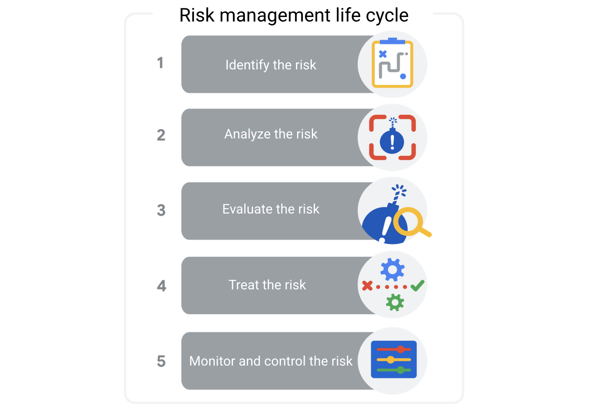
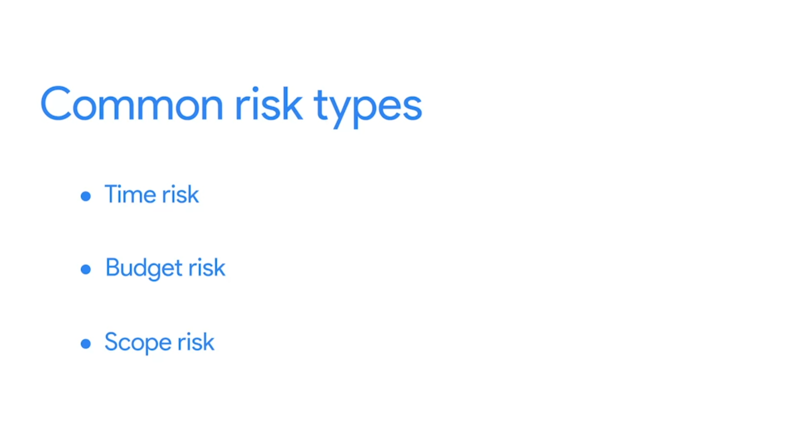
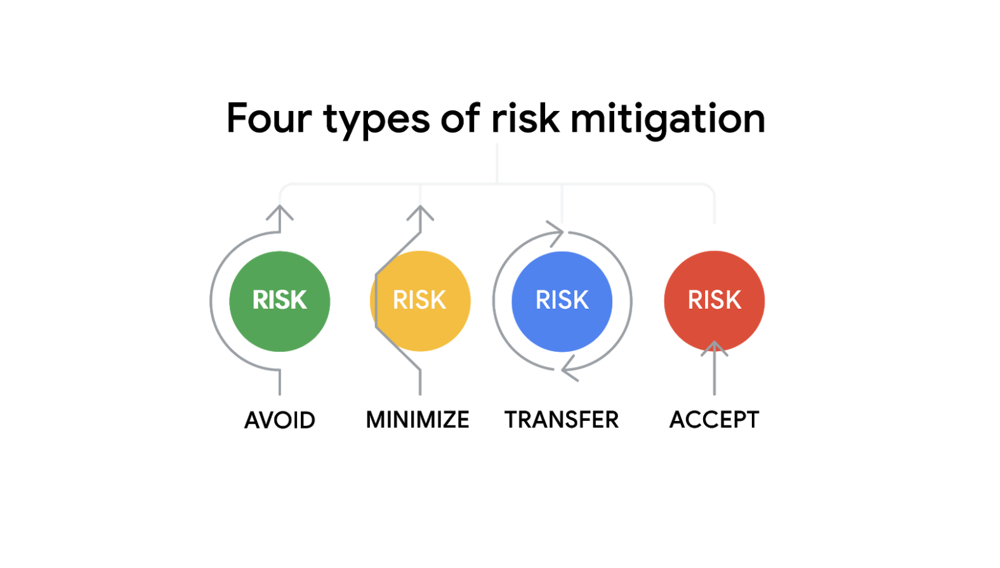
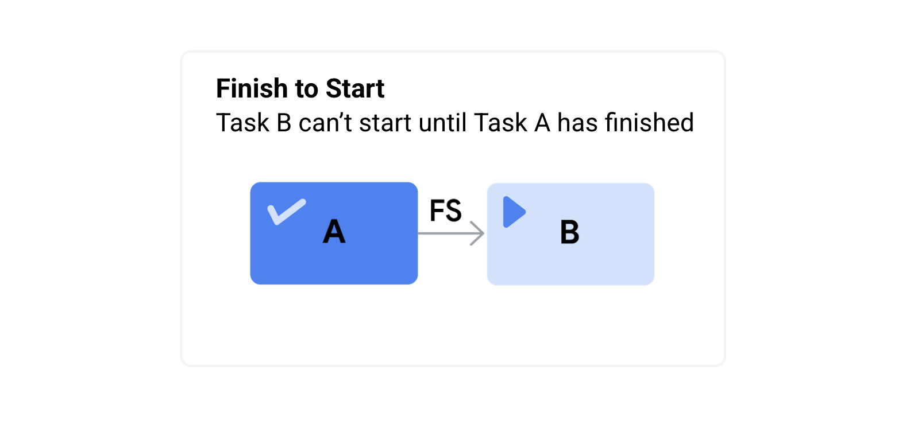
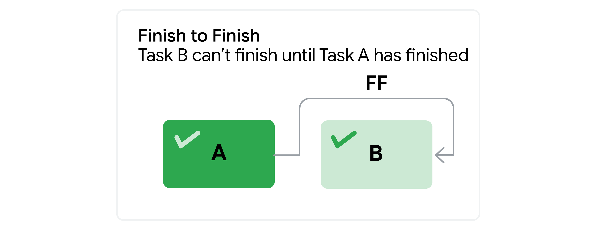
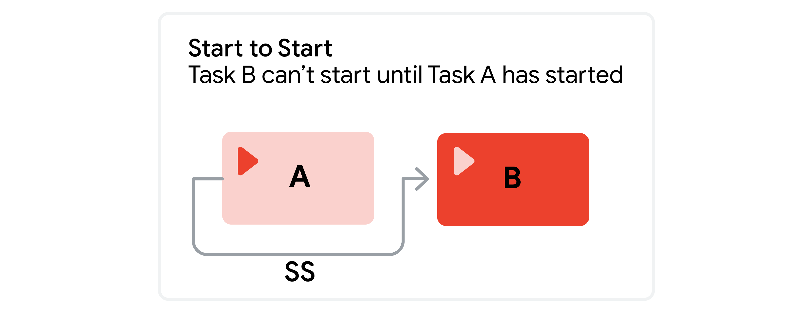
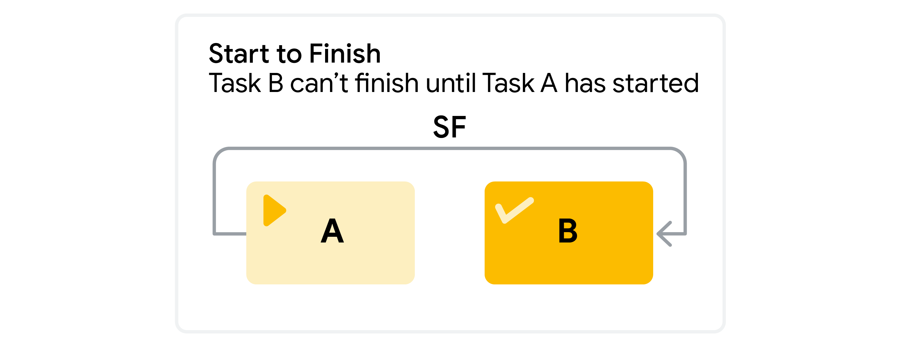

# Managing risks effectively

Risk management is the process of identifying and evaluating potential risks and issues that could impact your project. Risk management is an ongoing practice throughout the life cycle of your project. It typically involves some variation of these five steps:

Let’s break these down:
1. **Identify the risk**. The first phase of the risk management process is to identify and define potential project risks with your team. After all, you can only manage risks if you know what they are. 

2. **Analyze the risk**. After identifying the risks, determine their likelihood and potential impact to your project. Serious risks with a high probability of occurring pose the greatest threat.

3. **Evaluate the risk**. Next, use the results of your risk analysis to determine which risks to prioritize.

4. **Treat the risk**. During this phase, make a plan for how to treat and manage each risk. You might choose to ignore minor risks, but serious risks need detailed mitigation plans.

5. **Monitor and control the risk**. Finally, assign team members to monitor, track, and mitigate risks if the need arises.

### Uncover opportunities using risk management
When you think about risks, it is likely that you automatically think of potential negative events. But when identifying risks, it is important to also consider the good things that could happen, which are considered opportunities. An opportunity is a potential positive outcome of a risk. It is important to recognize opportunities and to capitalize on them as they appear so you can reach your project goals faster, more cheaply, or with less effort. Some examples of opportunities include: 
- Completing a milestone ahead of schedule
- Discounted materials 
- Availability of additional resources (people, investments, equipment)

An opportunity is a potential positive outcome that may bring additional value to a project. You can use the same tools and techniques that you use in risk management—identify, analyze, evaluate, treat, and control—to add potential opportunities to your risk management plan. You need to know what to do if things go wrong, but you should also make plans to seize opportunities. By using techniques such as brainstorming and drawing on project history or prior experience, you can identify potential opportunities and outline how you will take advantage of them if they occur.

### Fishbone diagram
**Fishbone diagrams**—also known as **Ishikawa diagrams** or **cause-and-effect diagrams**—were developed by Japanese organizational theorist Kaoru Ishikawa in the 1960s to measure quality control processes in the shipbuilding industry. Fishbone diagrams are a visual way to look at cause and effect. They are called fishbone diagrams because they have a similar shape to a fish skeleton. Fishbone diagrams help the team to brainstorm potential causes of a problem or risk and sort them into useful categories. These categories show the areas that you should focus on to mitigate that risk. Fishbone diagrams are also very helpful in finding the root cause of a problem. A root cause is the initial cause of a situation that introduces a problem or risk. The purpose of using fishbone diagrams in risk management is to identify the root cause of a potential problem for a project or program.  

Identifying risks and measuring their potential impact on a project can be a complex task. You can help visualize these issues by creating fishbone diagrams. To recap, the steps to create a fishbone diagram are:
- Define the problem
- Identify the categories
- Brainstorm the causes
- Analyze the causes

Once you’ve developed a fishbone diagram to help find a problem’s root cause and measure its potential impact on the project, you can then move on to determining how to mitigate the risk. 

### Managing single point of failure risks
Once you have identified your risks and ranked them, give special attention to the risks that could have a catastrophic effect on your team’s ability to complete the project. A single point of failure is a risk that, if it were to materialize, could cause a significant amount of disruption to your project and could even shut it down. You should plan for these risks early on in the project. 

If you have strategies you can rely on for avoiding, minimizing, transferring, and accepting project risks—including single point of failure risks—you will be in a better position to protect your project from the possible impact of these risks.    

### Visualizing dependency relationships
A dependency graph can help you visualize these different dependencies and the flow of the work that needs to be done on a project. They can also help you identify any risk associated with them. 

