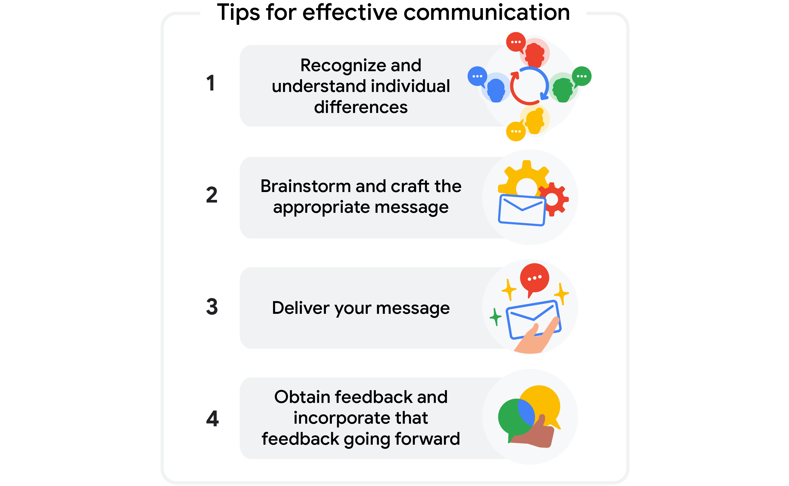

# Organizing communication and documentation
Communication is key to any successful project. As a project manager, you are central to that communication, which is an ongoing process throughout the life cycle of a project. A good project manager must be effective in communicating with all stakeholders and team members through various mediums. As the project manager, it is important to develop a communication plan for the duration of your project. Good communication helps your project run smoothly, leads to better outcomes, and supports a healthy team culture. You can use these four tips to foster effective communication within your team: 

## Best practices for building a communication plan
### Identify, identify, identify
Before you begin creating the plan, answer these questions to ensure that you have all of the relevant information:
- **Project stakeholders**: Have you created a RACI chart or stakeholder map of all your stakeholders? Who is your audience? Who will need to be informed at different points during the project life cycle? 
- **Communication frequency and method**: When and how often should you check in with your stakeholders? What methods of communication do they prefer? How much detail does each stakeholder need? 
- **Goals**: What is the goal of your communication? Do you need a response? Are you trying to encourage engagement or simply providing an update? 
- **Barriers**: Are there any time zone limitations? Language barriers? Do some stakeholders require time to reply or respond (e.g., an executive)? Are there any privacy or internet access issues? 

### Document and develop
Choose a tool or template to document all of your communication needs, and begin developing your plan. Once you understand the basic elements (stakeholders, communication methods, goals, and barriers), it’s time to work out the details! Here are some tips:

- **Add a column for notes**. Project management is not one-size-fits-all, and there are a lot of pieces that need to be tracked. For instance, if you are reaching out to a senior leader or executive, do you need to copy anyone else on the email? If a stakeholder is out of office or unavailable on certain dates, do you have a backup plan? Add notes to set reminders and any additional relevant details.
- **Use formatting to highlight any key details in the plan**. Is there a launch announcement or an urgent decision needed for the project to move forward? Highlight these pivotal elements in a different font color or size to stress their importance.
- **Ensure that the team can access your document**. Share the plan with your team. Allowing your team to review the document ensures that they are aware of the plan and gives them a chance to offer feedback. Sharing the document also serves as an extra check to make sure you aren’t missing any crucial pieces.
- **Test your plan**. If you are sending a team-wide email or link, send a test email to yourself or a colleague. If you are planning a virtual presentation, be sure to test the visual, audio, and other technical aspects in advance. That way, you can minimize any technical problems.  

### Check in
Once your communication plan is out in the world, check in with your audience about the effectiveness of your plan. Scheduling routine check-ins will help you understand what is and is not working so you can improve your plan. You want to ensure that your communication plan gets the right information to the right stakeholders at the right time. Additionally, make sure to double check that key stakeholders have not changed over time. Evaluate where you may be over- or under-sharing information or missing stakeholders. You can do this through:
- Anonymous survey forms 
- Polls or open feedback sessions during team meetings
- One-on-one conversations and check-ins with key stakeholders

