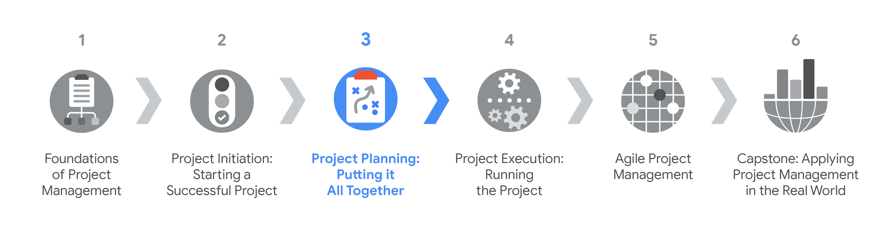
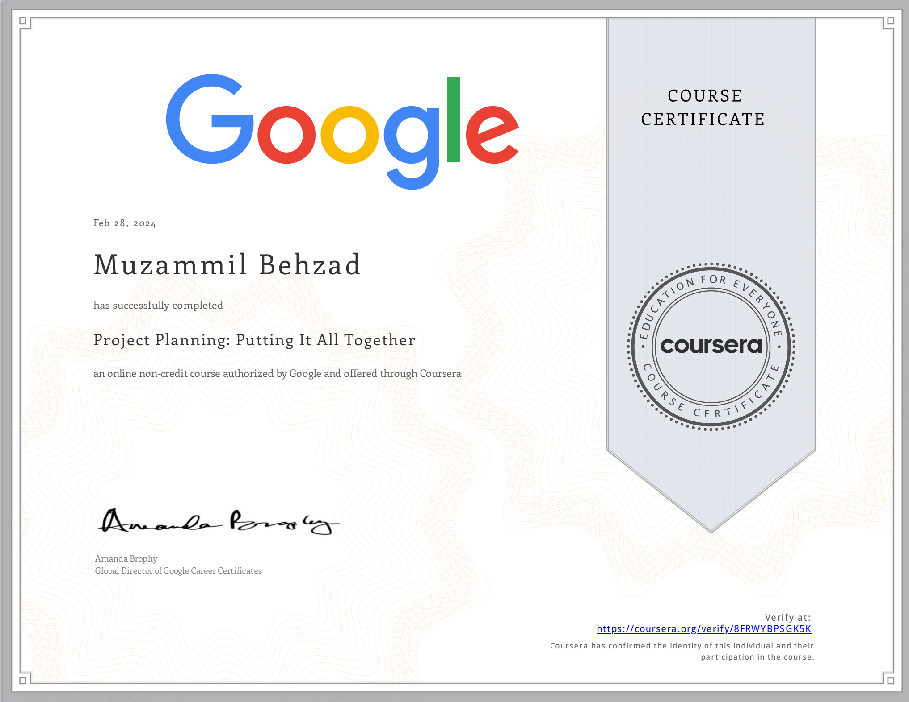

# Project Planning: Putting It All Together
The knowledge base contanis a specialization overview from the course [Project Planning: Putting It All Together](https://www.coursera.org/learn/project-planning-google?specialization=google-project-management) by Google on [Coursera](https://www.coursera.org/). It is divided into following modules:
- [Beginning the planning phase](./Beginning%20the%20planning%20phase.md)
- [Building a project plan]()
- [Managing budgeting and procurement]()
- [Managing risks effectively]()
- [Organizing communication and documentation]()

This is the third course in the Google Project Management Certificate program. This course will explore how to map out a project in the second phase of the project life cycle: the project planning phase. You will examine the key components of a project plan, how to make accurate time estimates, and how to set milestones. Next, you will learn how to build and manage a budget and how the procurement processes work. Then, you will discover tools that can help you identify and manage different types of risk and how to use a risk management plan to communicate and resolve risks. Finally, you will explore how to draft and manage a communication plan and how to organize project documentation.

By the end of this course, you will be able to: 
 - Describe the components of the project planning phase and their significance.
 - Explain why milestones are important and how to set them. 
 - Make accurate time estimates and describe techniques for acquiring them from team members.  
 - Identify tools and best practices to build a project plan and risk management plan. 
 - Describe how to estimate, track, and maintain a budget.
 - Explain the procurement process and identify key procurement documentation. 
 - Draft a communication plan and explain how to manage it.
 - Explain why milestones are important and how to set them. 
 - Explain why a project plan is necessary and what components it contains. 
 - Make accurate time estimates and describe techniques for acquiring them from team members.

[Here](https://www.coursera.org/account/accomplishments/verify/FPAJPEMFGNPJ) is my certification for this first course.

## Certification Overview
###  Google Project Management Certification
**Project managers** are natural problem-solvers. They set the plan and guide teammates, and manage changes, risks, and stakeholders. This [Google Project Management: Professional Certificate](https://www.coursera.org/professional-certificates/google-project-management) includes over 140 hours of instruction and hundreds of practice-based assessments which will help you simulate real-world project management scenarios that are critical for success in the workplace. The content is highly interactive and exclusively developed by Google employees with decades of experience in program and project management.

**Skills you’ll gain will include**: Creating risk management plans; Understanding process improvement techniques; Managing escalations, team dynamics, and stakeholders; Creating budgets and navigating procurement; Utilizing  project management software, tools, and templates; Practicing Agile project management, with an emphasis on Scrum.

Through a mix of videos, assessments, and hands-on activities, you’ll get introduced to initiating, planning, and running both traditional and Agile projects. You’ll develop a toolbox to demonstrate your understanding of key project management elements, including managing a schedule, budget, and team.

### Certification Content

The [Google Project Management: Professional Certificate](https://www.coursera.org/professional-certificates/google-project-management) contains six courses.

- Foundations of Project Management
- Project Initiation: Starting a Successful Project
- **Project Planning: Putting It All Together**
- Project Execution: Running the Project
- Agile Project Management
- Capstone: Applying Project Management in the Real World

Most of the content is from the course itself. © Google and Coursera.